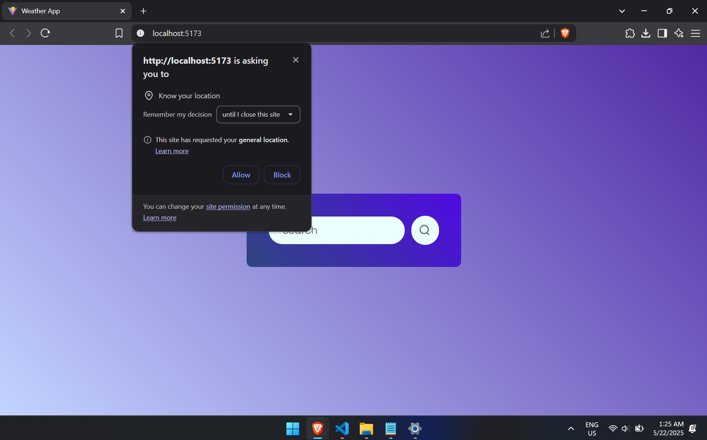
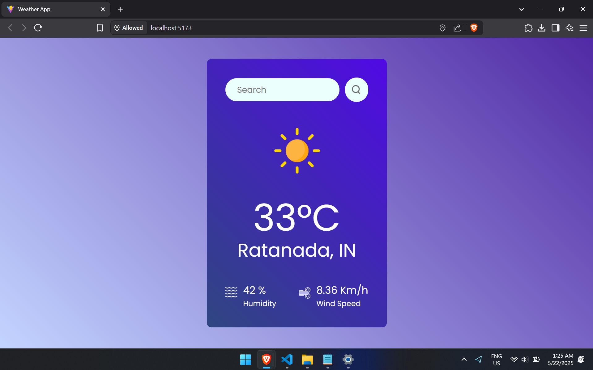
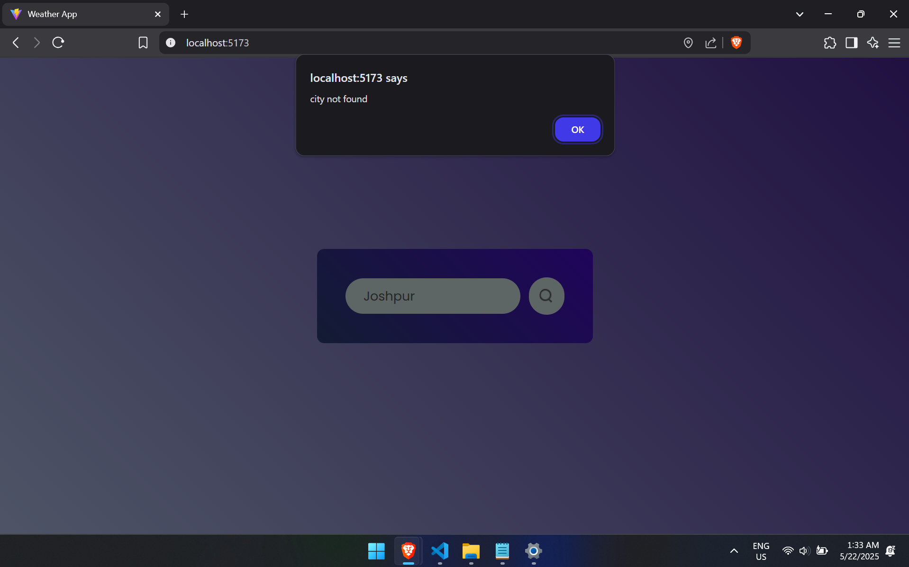
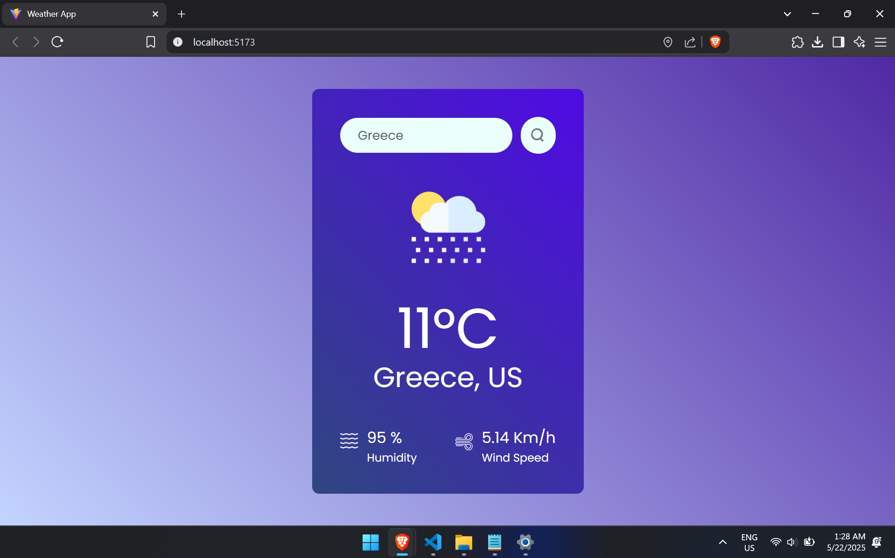
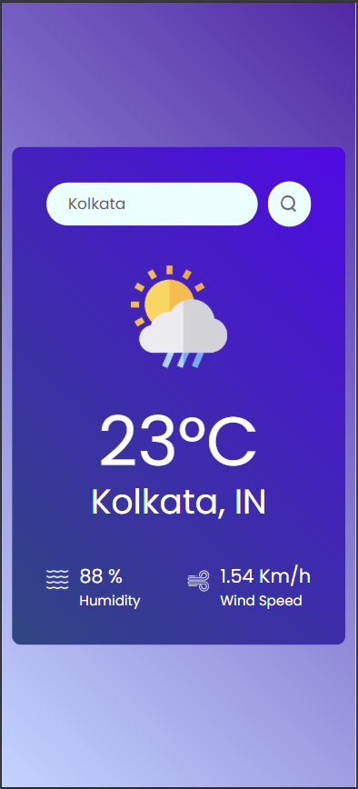

# React Weather App

This is a simple weather application built using React. It fetches real-time weather data from the OpenWeatherMap API and displays it in a user-friendly interface.

## Features

- **Search by City**: Enter the name of a city to get its current weather.
- **Geolocation Support**: Automatically fetches weather data for your current location using your device's geolocation.
- **Weather Details**: Displays temperature, location, humidity, wind speed, and weather conditions with appropriate icons.
- **Responsive Design**: Works seamlessly on both desktop and mobile devices.

## Screenshots







## Installation

1. Clone the repository:
   ```bash
   git clone https://github.com/xitesh/React-Weather-App.git
   ```
2. Navigate to the project directory:
   ```bash
   cd React-Weather-App
   ```
3. Install dependencies:
   ```bash
   npm install
   ```
4. Start the development server:
   ```bash
   npm run dev
   ```
5. Open your browser and navigate to `http://localhost:5173`.

## Environment Variables

To run this project, you need to add the following environment variable in a `.env` file at the root of the project:

```
VITE_APP_ID=your_openweathermap_api_key
```

Replace `your_openweathermap_api_key` with your OpenWeatherMap API key. You can obtain one by signing up at [OpenWeatherMap](https://openweathermap.org/).

## Technologies Used

- React
- Vite
- OpenWeatherMap API
- CSS for styling

## Folder Structure

```
React-Weather-App/
├── public/
│   └── vite.svg
├── src/
│   ├── assets/
│   │   ├── clear.png
│   │   ├── cloud.png
│   │   ├── drizzle.png
│   │   ├── humidity.png
│   │   ├── rain.png
│   │   ├── search.png
│   │   ├── snow.png
│   │   └── wind.png
│   ├── components/
│   │   ├── Weather.css
│   │   └── Weather.jsx
│   ├── App.jsx
│   ├── index.css
│   └── main.jsx
├── .env
├── package.json
├── vite.config.js
└── README.md
```

## Contributing

Contributions are welcome! Feel free to open an issue or submit a pull request for any improvements or bug fixes.

## License

This project is licensed under the MIT License. See the [LICENSE](LICENSE) file for details.

## Acknowledgements

- [OpenWeatherMap](https://openweathermap.org/) for providing the weather API.
- [Vite](https://vitejs.dev/) for the fast development environment.

---

Happy coding!